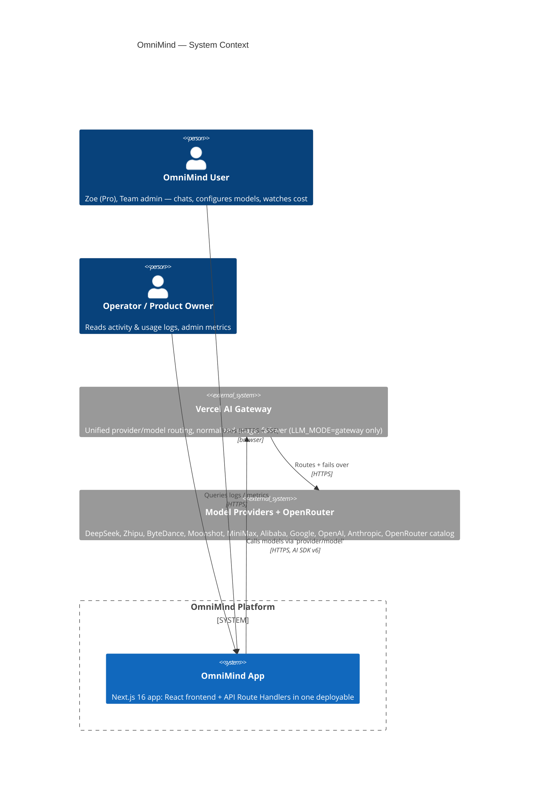
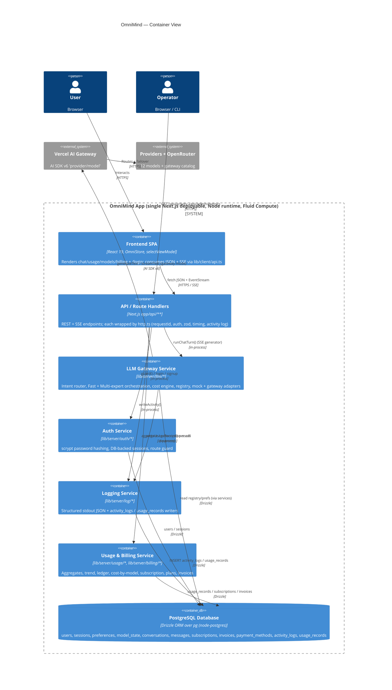
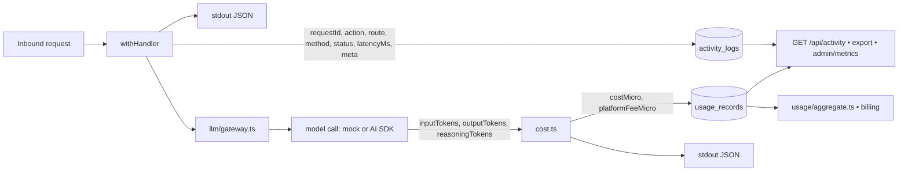

# OmniMind — System Architecture

**Status:** Draft for implementation · **Date:** 2026-06-18
**Owners:** Backend Engineering
**Frozen inputs:** [tech-stack.md](decisions/tech-stack.md), [llm-sdk-evaluation.md](decisions/llm-sdk-evaluation.md)
**Traces:** [PRD.md](PRD.md) (FR-/NFR-), [user-stories.md](user-stories.md) + [user-stories-part2.md](user-stories-part2.md) (US1–US10)

> This document describes the **backend** system architecture for OmniMind. The Next.js 16 +
> React 19 + TypeScript **frontend is already built** (`app/`, `components/`, `lib/`) and is the
> source of truth for behavior; the in-memory `OmniStore` (`lib/store.ts`) and `selectViewModel`
> (`lib/viewModel.ts`) define every value the backend must produce. The stack is **frozen** — this
> architecture honors it exactly: Next.js Route Handlers, Drizzle/PostgreSQL, node:crypto sessions,
> Vercel AI SDK v6 via AI Gateway with a deterministic mock provider, and structured logging into
> `activity_logs` + `usage_records`.

---

## 1. C4 — Context & Container views

### 1.1 System context (C1)

The platform is one deployable (frontend + API in the same Next.js app). External actors are the
human user, the Vercel AI Gateway (and through it model providers + OpenRouter), and operators who
read observability data. With `LLM_MODE=mock` (default) no external model dependency exists — the
mock provider stands in for the entire gateway.



> **Mock mode (default, keyless):** the dashed `app → gateway → providers` path is replaced by an
> in-process `MockLanguageModelV2` backed by the existing `lib/content.ts` engine. Identical
> request/response/SSE shapes; only token text + counts differ (NFR-5, G7).

### 1.2 Container view (C2)

One Next.js process. The browser SPA talks to Route Handlers (`app/api/**`); handlers delegate to
server-side services under `lib/server/**`. The **LLM Gateway service** is the single choke point
for every model call, wrapping the AI SDK and selecting mock-vs-gateway at runtime.



### 1.3 Directory layout (authoritative, per frozen stack)

```
app/api/
  auth/{signup,login,logout,session,sso}/route.ts
  chat/route.ts                        # POST fast|expert → SSE; POST regenerate (regenerateTurnId)
  chat/route/route.ts                  # POST routing preview (no model call)
  conversations/route.ts               # GET list / POST create
  conversations/[id]/route.ts          # PATCH rename / DELETE
  conversations/[id]/messages/route.ts # GET history (rehydrate a turn)
  models/route.ts                      # GET list (+ ?gateway=openrouter)
  models/[id]/route.ts                 # PATCH enabled / setMain
  preferences/route.ts                 # GET / PATCH
  usage/{summary,trend,by-model,ledger,export}/route.ts
  billing/{subscription,plans,invoices,topup,payment-method}/route.ts
  activity/route.ts                    # GET query; activity/export/route.ts
  admin/metrics/route.ts               # admin-guarded
lib/server/
  http.ts                              # withHandler(): requestId, auth, zod, timing, envelope, activity log
  db/{client.ts,schema.ts,migrate.ts}
  contracts/                           # zod schemas shared with the client
  auth/{password.ts,session.ts,guard.ts}
  llm/{gateway.ts,registry.ts,router.ts,fusion.ts,mock.ts,cost.ts}
  log/{logger.ts,activity.ts}
  usage/{ledger.ts,aggregate.ts}
  billing/{plans.ts,subscription.ts}
lib/client/api.ts                      # typed fetch + SSE client used by the React app
```

---

## 2. Component responsibilities

### 2.1 Frontend (unchanged contract)
- **`OmniStore` / `selectViewModel`** remain the rendering brain. The only change is data source:
  instead of seeding an in-memory ledger and running a wall-clock streaming loop locally, the store
  consumes JSON from `lib/client/api.ts` and an **SSE stream** from `POST /api/chat`. The store's
  streaming-frame model (mutate-in-place + bump `tick`) maps directly onto SSE deltas.
- **`lib/client/api.ts`** — typed fetch wrapper: attaches credentials (cookie), parses the
  `{ ok, data | error }` envelope, surfaces `x-request-id`, and exposes a `chatStream()` helper that
  reads `text/event-stream` and yields typed events (§4, §6).

### 2.2 API / Route Handlers (`app/api/**` + `http.ts`)
- **`withHandler(action, schema, fn)`** — the single request wrapper used by **every** route. It:
  assigns `requestId = crypto.randomUUID()`; runs the auth guard where required; validates the
  body/query with a zod **contract**; times execution with `performance.now()`; serializes the
  `{ ok, data } | { ok, error }` envelope; writes exactly **one** `activity_logs` row; and sets the
  `x-request-id` response header. Logging is best-effort and never blocks or fails the response
  (FR-41, NFR-13, US10.UC1). SSE routes use a streaming variant that still writes the activity row at
  stream close (with final status + total `latencyMs`).
- **Per-resource handlers** are thin: parse → call a `lib/server` service → return data. No business
  logic, cost math, or model access lives in a handler.

### 2.3 LLM Gateway service (`lib/server/llm/*`) — the orchestration core
- **`registry.ts`** — authoritative server mirror of `lib/models.ts`: the 12 `ModelDef`s (id, name,
  vendor, color, initials, tier, localized tags, `ctx`, `pin`/`pout`), plus `OPENROUTER_MODELS`. A
  sync test asserts equality with the client table (R1, FR-18, US5.UC1). Cost math reads **only** this
  registry.
- **`router.ts`** — intent router; a 1:1 server port of `route()` in `lib/content.ts`. Maps prompt →
  `{ id, label }` with the exact regex rules (code→`deepseek-pro`, writing→`claude-opus`,
  translation→`qwen`, summary/quick→`deepseek-flash`, planning→`gemini-pro`, else→`gpt-55`) and
  localizes `label` via `pick()`. Honors per-user **enablement** — a routed-to disabled model falls
  back to the next eligible model and flags `fallback=true` (FR-13, US2.UC2, US4.UC1).
- **`gateway.ts`** — the **single call site** for all model invocations. Exposes
  `runChatTurn(input): AsyncIterable<TurnEvent>` (the orchestrator) and a lower-level
  `callModel(modelId, messages, role, ctx)`. Selects the adapter by `LLM_MODE`:
  - `gateway` → AI SDK v6 `streamText({ model: "provider/model", … })` through the AI Gateway,
    reading the SDK's normalized `usage` (`inputTokens`/`outputTokens`/`reasoningTokens`).
  - `mock` → `mock.ts`. Every call, regardless of mode, flows back through `cost.ts` and the usage
    writer (FR-9, FR-10, NFR-8, US10.UC2).
- **`mock.ts`** — deterministic `MockLanguageModelV2` + `simulateReadableStream` backed by
  `lib/content.ts` (`buildAnswer` / `buildReason` / `buildFusion`). Wall-clock paced at ~360 chars/sec
  with the existing per-call stagger to mirror current UX; token counts via `estTok` (`round(len/1.8)`).
  Fixed-seed deterministic for exact-value tests (NFR-1, NFR-5, A4).
- **`fusion.ts`** — Multi-expert orchestration: launches the trio **concurrently**, gates the fusion
  stage on `experts.every(done)`, then drives the compiler's `reason` (thinking trace) and `answer`
  (consolidated rewrite) phases. Implements graceful degradation: a failed expert is dropped, fusion
  proceeds over survivors, and the partial is flagged (FR-9, NFR-16, US3, R5).
- **`cost.ts`** — the cost engine. `costMicro = round(inTok/1e6 × pin + outTok/1e6 × pout)` in
  micro-cents (integer), `platformFeeMicro = PLATFORM_FEE_CNY` per call; unknown model → default
  `{in:5,out:15}` with `pricingFallback=true`. This reproduces `respCost`/`aggregate` exactly
  (FR-20, NFR-6, NFR-7, R2).

### 2.4 Auth service (`lib/server/auth/*`)
- **`password.ts`** — node:crypto **scrypt** with per-user random salt; constant-time verify. Hash and
  salt never logged or returned (NFR-9, US1.UC1/UC2).
- **`session.ts`** — opaque DB-backed sessions; create/lookup/expire; lazy deletion of expired rows on
  read. Cookie: `httpOnly; SameSite=Lax; Secure` (prod); longer TTL when `remember=true`.
- **`guard.ts`** — `requireUser(req)` resolves the session → user (+ plan + preferences) or throws
  `401 AUTH_REQUIRED`. Used by `withHandler` for protected routes; also enforces resource ownership
  (NFR-10).

### 2.5 Usage & Billing services
- **`usage/aggregate.ts`** — server port of `aggregate()`: totals, 7-day trend (zero-filled,
  local-day buckets), cost-by-model (sorted desc, `sharePct`), all summed from persisted
  `usage_records` in micro-cents (FR-21–FR-23, US6.UC1–UC3).
- **`usage/ledger.ts`** — per-turn ledger rows: newest-first, cursor-paginated, each turn joining its
  `usage_records` (distinct role-ordered models, tokens, modelCost, fee, total) (FR-24, US6.UC4).
- **`billing/plans.ts`** — canonical Free/Pro/Team/Enterprise with `includedCreditMicro`, price,
  period, localized feature keys (FR-27, US7.UC2).
- **`billing/subscription.ts`** — current subscription + month-to-date (from `usage_records` over the
  calendar month), plan change, top-up (+invoice), payment-method descriptor (FR-26, FR-29–FR-31,
  US7).

### 2.6 Logging service (`lib/server/log/*`)
- **`logger.ts`** — structured stdout JSON logger (mirrors every DB row) so logs exist without DB
  access (FR-46).
- **`activity.ts`** — `writeActivity(row)` → `activity_logs`; `writeUsageRecord(row)` → `usage_records`.
  Both append to DB and emit JSON. Called from `http.ts` (one activity row/request) and `gateway.ts`
  (one usage row/model call) (FR-41, FR-42, NFR-13).

### 2.7 Database (`lib/server/db/*`)
- **`client.ts`** — `pg` (node-postgres) via `drizzle-orm/node-postgres`; `DATABASE_URL` is a
  required `postgres://` connection string (Neon, Supabase, RDS, or self-hosted) with no local/file
  fallback. Pooler params (pgbouncer/connection_limit/pool_timeout) are parsed and ignored safely.
  **`schema.ts`** — Drizzle tables (§7.). **`migrate.ts`** — idempotent migrations; self-creates
  schema on first run for local/CI (NFR-18).

---

## 3. Request lifecycle (auth → validate → handle → log)

Every non-streaming request passes through the **same** `withHandler` pipeline. The pipeline owns
auth, validation, timing, the response envelope, and the single activity-log write — so no handler can
forget to log (R6, NFR-13).

```mermaid
sequenceDiagram
    autonumber
    participant C as Client (lib/client/api.ts)
    participant H as Route Handler (withHandler)
    participant G as guard.ts
    participant Z as zod contract
    participant S as Service (lib/server/*)
    participant D as PostgreSQL (Drizzle)
    participant L as log/activity.ts

    C->>H: HTTP request (cookie)
    Note over H: requestId = randomUUID(); t0 = performance.now()
    H->>G: requireUser() (protected routes)
    G->>D: SELECT session JOIN user
    alt no / expired session
        G-->>H: throw 401 AUTH_REQUIRED
        H->>L: writeActivity(status=401, latencyMs)
        H-->>C: { ok:false, error } + x-request-id
    else valid session
        G-->>H: { user, plan, preferences }
        H->>Z: parse(body|query)
        alt invalid
            Z-->>H: ZodError
            H->>L: writeActivity(status=400, latencyMs)
            H-->>C: { ok:false, VALIDATION } + details
        else valid
            H->>S: service(input, ctx{ userId, requestId })
            S->>D: ownership-scoped query / mutation
            D-->>S: rows
            S-->>H: data
            H->>L: writeActivity(action, route, status=200, latencyMs)
            H-->>C: { ok:true, data } + x-request-id
        end
    end
```

**Invariants:** exactly one `activity_logs` row per served request (success, validation error, auth
error, or 500). The `requestId` appears on the response header and in the log row. Log writes are
best-effort: a logging failure is swallowed to stderr and never changes the response (US10.UC1).

---

## 4. Multi-expert orchestration flow (US3, FR-9/FR-10/FR-11)

`POST /api/chat` with `mode="expert"` opens an SSE stream and runs the trio **in parallel**, gates
fusion on all experts finishing, streams the compiler's reasoning trace, then the consolidated final
answer. Each model call (N experts + 1 fusion) is independently metered and persisted with its own
¥0.05 fee.

```mermaid
sequenceDiagram
    autonumber
    participant C as Client
    participant H as chat/route.ts (SSE)
    participant O as fusion.ts (orchestrator)
    participant E1 as Expert A (gateway.callModel)
    participant E2 as Expert B
    participant E3 as Expert C
    participant FC as Final Compiler (mainModel)
    participant Cost as cost.ts
    participant L as log/activity.ts
    participant D as PostgreSQL

    C->>H: POST { mode:"expert", prompt, trio, mainModel, deepResearch }
    H->>D: upsert conversation + user message; create turnId
    H-->>C: event: turn.start { turnId, mode:"expert" }
    H->>O: runChatTurn(input)

    par Experts stream concurrently
        O->>E1: callModel(trio[0], "expert")
        E1-->>C: call.start{A} → call.delta{A}…
        E1->>Cost: usage(A)
        Cost->>L: writeUsageRecord(role="expert", A)
        L->>D: INSERT usage_records
        E1-->>C: call.usage{A}
    and
        O->>E2: callModel(trio[1], "expert")
        E2-->>C: call.start{B} → call.delta{B}…
        E2->>Cost: usage(B)
        Cost->>L: writeUsageRecord(role="expert", B)
        E2-->>C: call.usage{B}
    and
        O->>E3: callModel(trio[2], "expert")
        E3-->>C: call.start{C} → call.delta{C}…
        E3->>Cost: usage(C)
        Cost->>L: writeUsageRecord(role="expert", C)
        E3-->>C: call.usage{C}
    end

    Note over O: gate on experts.every(done); degrade gracefully if one failed (NFR-16)

    O->>FC: reasoning phase (compiler = mainModel)
    FC-->>C: reason.start → reason.delta… → reason.done
    O->>FC: final synthesis phase
    FC-->>C: answer.delta… (one fresh consolidated rewrite)
    FC->>Cost: usage(fusion) incl. reasoningTokens
    Cost->>L: writeUsageRecord(role="fusion")
    L->>D: INSERT usage_records
    FC-->>C: call.usage{fusion}

    O->>H: rollup
    H->>D: persist assistant message (experts[] + fusion text + per-call usage)
    H-->>C: turn.usage { turnTok, turnCost, turnFee=(N+1)×¥0.05, turnTotal, callCount=N+1 }
    H-->>C: turn.done
    H->>L: writeActivity(action="chat.send", mode="expert", status=200, latencyMs)
```

**Key properties**
- Experts are concurrent; wall-clock ≈ slowest expert + fusion, not the sum (NFR-3).
- Reasoning tokens are tracked separately and stored on the fusion row's `reasoningTokens` (US3.UC2).
- The fusion answer is a fresh rewrite (`buildFusion`), not byte-identical to any expert (US3.UC3).
- Turn total = Σ(expert costs) + fusion cost + `(N+1) × ¥0.05` (FR-11, US3.UC4/UC5, NFR-7).
- A degraded turn bills only the calls that ran; `details` notes the degraded count (R5).
- **Regenerate** (`regenerateTurnId`) reloads the original prompt + same trio + same compiler, re-runs
  this exact pipeline, replaces the assistant message in place, and writes **fresh** usage rows
  (FR-12, US3.UC4).

---

## 5. Fast-mode flow (US2, FR-8)

`POST /api/chat` with `mode="fast"` resolves a single model (auto-route or manual `mainModel`),
streams one answer, then emits and persists a single-call usage record.

```mermaid
sequenceDiagram
    autonumber
    participant C as Client
    participant H as chat/route.ts (SSE)
    participant R as router.ts
    participant M as gateway.callModel (single)
    participant Cost as cost.ts
    participant L as log/activity.ts
    participant D as PostgreSQL

    C->>H: POST { mode:"fast", prompt, auto, mainModel, deepResearch }
    H->>D: upsert conversation + user message; create turnId
    H-->>C: event: turn.start { turnId, mode:"fast" }

    alt auto == true
        H->>R: route(prompt, lang) → { id, label, fallback? }
        R-->>H: { modelId, localized label }
        H-->>C: event: route { modelId, routeText }
    else auto == false (manual pick)
        Note over H: use mainModel; emit NO route event; reject if disabled → 400 MODEL_NOT_AVAILABLE
    end

    H->>M: callModel(modelId, "single")
    M-->>C: call.start → call.delta… (incremental tokens)
    M->>Cost: usage { inputTokens, outputTokens }
    Cost->>L: writeUsageRecord(role="single", costMicro, fee=¥0.05)
    L->>D: INSERT usage_records
    M-->>C: call.usage
    H->>D: persist assistant message (single text + usage)
    H-->>C: turn.usage { turnTok, turnCost, turnFee=¥0.05, turnTotal, callCount=1 }
    H-->>C: turn.done
    H->>L: writeActivity(action="chat.send", mode="fast", modelId, status=200, latencyMs)
```

Exactly **one** `usage_records` row with `role="single"` per Fast turn; `platformFeeMicro` is exactly
one ¥0.05 unit (US2.UC3/UC5, FR-8). Routing preview (`POST /api/chat/route`) runs `router.ts` only,
returns `{ modelId, label }`, writes an activity row, and writes **no** usage record (US4.UC1).

---

## 6. Streaming design (SSE)

### 6.1 Transport
- **Runtime:** Node.js runtime on Vercel **Fluid Compute** (not Edge) so long-lived streams,
  concurrency, and `node:crypto` all work (R3). Handlers return a `Response` whose body is a
  `ReadableStream` produced from the `runChatTurn` async generator. **No full-buffering** — bytes are
  flushed as the model yields (NFR-2).
- **Headers:** `Content-Type: text/event-stream`, `Cache-Control: no-cache, no-transform`,
  `Connection: keep-alive`, `X-Accel-Buffering: no`, `x-request-id: <uuid>`.
- **Heartbeats:** SSE comment lines (`: ping`) every ~15 s keep idle proxies from closing long
  Multi-expert turns (NFR-2).
- **First-token budget:** `turn.start` is emitted within **300 ms** of receipt (excludes model time)
  (NFR-1).

### 6.2 Event protocol (typed; FR-10)
Each event is an SSE `event:`/`data:` pair with a JSON payload. Call-scoped events carry `modelId` and
`role ∈ {single, expert, fusion}`.

| Event | Payload (data) | When |
|-------|----------------|------|
| `turn.start` | `{ turnId, conversationId, mode }` | Immediately after the turn row is created |
| `route` | `{ modelId, routeText, fallback? }` | Fast + `auto`, before streaming |
| `call.start` | `{ modelId, role }` | A model call begins |
| `call.delta` | `{ modelId, role, text }` | Incremental answer tokens |
| `call.usage` | `{ modelId, role, inputTokens, outputTokens, reasoningTokens?, costMicro, platformFeeMicro }` | A model call finishes |
| `reason.start` / `reason.delta` / `reason.done` | `{ text? }` | Compiler thinking trace (expert mode) |
| `answer.delta` | `{ text }` | Consolidated final answer (expert) / aliased onto `call.delta` (fast) |
| `turn.usage` | `{ turnTok, turnCost, turnFee, turnTotal, callCount }` | Rollup before close |
| `turn.done` | `{ turnId }` | Turn complete; stream may close |
| `error` | `{ code, message, requestId, partial? }` | Typed failure; degraded experts noted in `partial` |

### 6.3 Client mapping & lifecycle
- `lib/client/api.ts` `chatStream()` reads the `EventStream`, dispatching events into `OmniStore`
  mutations (append delta to the matching `StreamCall.full`/`shown`, flip `done`, fill `fusion.reason`
  / `fusion.full`, then bump `tick`). This maps 1:1 onto the store's existing mutate-in-place model.
- **Concurrency guard:** a second `POST /api/chat` for a conversation already streaming → `409
  STREAM_IN_PROGRESS` (mirrors the store's `if (streaming) return`) (US2.UC1, US3.UC4).
- **Disconnect:** the handler observes `request.signal` abort; it cancels in-flight model work where
  possible, still persists usage for **completed** calls, closes cleanly — no orphaned turns (NFR-17).

---

## 7. Observability / logging architecture (US10, FR-41–FR-46)

Two write paths, two tables, one stdout mirror. Every served request writes **one** `activity_logs`
row (from `http.ts`); every model call writes **one** `usage_records` row (from `gateway.ts` via
`cost.ts` → `log/activity.ts`). Both also emit structured JSON to stdout so logs survive without DB
access (FR-46, NFR-13).



### `activity_logs` — one row per request (US10.UC1)
`{ id, requestId, userId|null, action (stable id e.g. "chat.send"|"usage.summary"|"models.toggle"),
route, method, status, latencyMs, meta(json), createdAt(epoch-ms) }`. Written by `http.ts` at request
close, including on thrown 500s. `meta` carries route-specific context (e.g. `{ mode, modelId }`,
`{ window }`) but **never** full prompt content (NFR-12).

### `usage_records` — one row per model call (US10.UC2)
`{ id, requestId, conversationId, turnId, userId, modelId, role(expert|fusion|single), inputTokens,
outputTokens, reasoningTokens, costMicro, platformFeeMicro, latencyMs, meta(json), createdAt }`.
Written by `gateway.ts` after each call. A Fast turn → 1 row; an expert turn → N+1 rows. When a
provider returns no `usage`, counts are estimated via `estTok` and `meta.usageEstimated=true`.

### Query / export / metrics
- `GET /api/activity` (US10.UC3) — filter by `{ from, to, action, route, status }`, cursor-paginated,
  ownership-scoped for users; admins may pass `userId`. Writes its own `activity.query` row.
- `GET /api/activity/export` + `GET /api/usage/export` (US10.UC4, US6.UC5) — stream filtered rows as
  CSV/JSON (money as integer micro-cents + a formatted `¥` column); `Content-Disposition: attachment`.
- `GET /api/admin/metrics` (US10.UC5) — admin-guarded; derived purely from the two tables: request
  count, error rate (`status≥500/total`), p50/p95 latency, active users, total calls/tokens/cost/fee,
  `callsByModel[]`, `requestsByAction[]` (NFR-15).

---

## 8. Data flow for cost accounting (US6/US7, FR-20, NFR-6/7)

Cost is computed **once**, at the model-call boundary, in integer micro-cents, and never re-derived on
the client. All aggregates sum persisted `usage_records`, guaranteeing zero drift between a turn footer
and the Usage/Billing views (SM2).

```mermaid
flowchart TD
    subgraph Per call (gateway.ts)
        U["usage: inputTokens, outputTokens, reasoningTokens<br/>(AI SDK normalized | estTok in mock)"]
        P["registry.ts pricing pin / pout (per 1M, ¥)"]
        U --> CE["cost.ts:<br/>costMicro = round(inTok/1e6·pin + outTok/1e6·pout) ×1e6cents<br/>platformFeeMicro = PLATFORM_FEE_CNY (¥0.05)"]
        P --> CE
        CE --> UR[(usage_records: costMicro + platformFeeMicro)]
    end

    UR --> TR["Turn rollup (turn.usage event):<br/>turnCost = Σ costMicro · turnFee = callCount × fee · turnTotal"]
    UR --> AGG["usage/aggregate.ts:<br/>totals · 7-day trend · cost-by-model"]
    UR --> LED["usage/ledger.ts: per-turn ledger rows"]
    UR --> BILL["billing/subscription.ts:<br/>monthUsed = Σ(costMicro+fee) this month<br/>usedPct, remaining vs includedCredit (Pro ¥150)"]

    TR --> FE["Frontend footer (fmtMoney at edge)"]
    AGG --> FE
    LED --> FE
    BILL --> FE
```

**Money rules (frozen):** stored as integer **micro-cents (CNY)**; formatted only at the edge via
`fmtMoney` (`¥0.00` ≥1, `¥0.0000` ≥0.001, else `¥0.000000`); the registry mirrors `lib/models.ts`
(e.g. `gpt-55` pin 20 / pout 80) and is authoritative for cost math (FR-18, A2). The per-call fee is
exactly `PLATFORM_FEE_CNY` (¥0.05); a per-user "platform-fee display" preference is display-only and
never changes billed amounts (US9.UC5).

---

## 9. Deployment view

```mermaid
flowchart TB
    subgraph Vercel["Vercel — Fluid Compute (Node.js runtime)"]
        Edge[Static assets / RSC payload]
        Fn["Route Handlers app/api/**<br/>(streaming SSE, node:crypto, AI SDK v6)"]
    end

    Browser[User browser - SPA + SSE] -->|HTTPS| Edge
    Browser -->|HTTPS / EventStream| Fn

    Fn -->|Drizzle / pg (node-postgres)| PG[(PostgreSQL — Neon / Supabase / RDS / self-hosted)]
    Fn -.->|LLM_MODE=gateway| AIGW[Vercel AI Gateway]
    AIGW -.-> Prov[Providers + OpenRouter]

    Fn -->|stdout JSON| Logs[Vercel log drains / observability]
```

### Environments
| Concern | Local / CI | Production |
|---------|-----------|-----------|
| Compute | `next dev` / Vitest direct handler invocation | Vercel Fluid Compute, Node runtime |
| DB | PostgreSQL via `DATABASE_URL` (`postgres://`); in-process pglite (@electric-sql/pglite) in tests | PostgreSQL (Neon / Supabase / RDS / self-hosted) via `DATABASE_URL` |
| LLM | `LLM_MODE=mock` (deterministic, keyless) | `LLM_MODE=gateway` + `AI_GATEWAY_API_KEY` |
| Migrations | `npm run db:migrate` (idempotent, self-creating, NFR-18) | run on deploy |
| e2e | Playwright vs `next dev` | — |

### Environment variables (from `.env.example`)
| Var | Purpose | Default |
|-----|---------|---------|
| `DATABASE_URL` | PostgreSQL connection string (`postgres://`); required | unset (required) |
| `LLM_MODE` | `mock` \| `gateway` | `mock` |
| `AI_GATEWAY_API_KEY` | AI Gateway key (gateway mode only) | unset |
| `PLATFORM_FEE_CNY` | per-call platform fee | `0.05` |
| `APP_SECRET` | session/app secret | dev-only placeholder |

### Runtime mode selection (`LLM_MODE`)
`lib/server/llm/gateway.ts` reads `LLM_MODE` once at module load. `mock` (default) binds `callModel`
to the `MockLanguageModelV2` adapter (`mock.ts` + `content.ts`), enabling full product + test runs
with **zero** keys (G7, SM5). `gateway` binds to AI SDK v6 `streamText`/`generateText` over the AI
Gateway with `"provider/model"` strings and provider failover (NFR-16). The response/SSE shape and the
cost/logging pipeline are **identical** across modes — only token text and counts differ (NFR-8, R4).
No code path outside `gateway.ts` ever touches a provider (frozen: llm-sdk-evaluation.md).

---

## 10. Cross-cutting concerns (summary)

- **Security** — scrypt + per-user salt; opaque DB-backed httpOnly/SameSite=Lax/Secure sessions; zod
  at every boundary; ownership-scoped queries; no secrets in repo; logs/exports exclude full prompt
  content (NFR-9–NFR-12).
- **i18n** — all backend-produced strings (route labels, plan features, mode labels, localized tags)
  honor `lang ∈ {zh, zh-TW, en, ja}` via `pick()` with `en→zh` fallback; numbers/money/time match
  `fmtNum`/`fmtMoney`/`fmtTime` (NFR-19).
- **Testability** — Vitest invokes Route Handlers directly against an in-process PostgreSQL (@electric-sql/pglite);
  deterministic mock mode enables exact-value assertions; Playwright covers e2e against `next dev`
  (NFR-20, SM5).
- **Reliability** — graceful expert degradation, disconnect-safe streaming, idempotent self-creating
  migrations (NFR-16–NFR-18).
```
